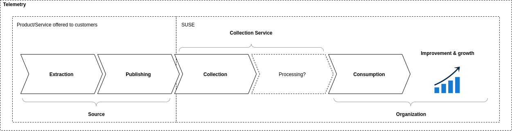
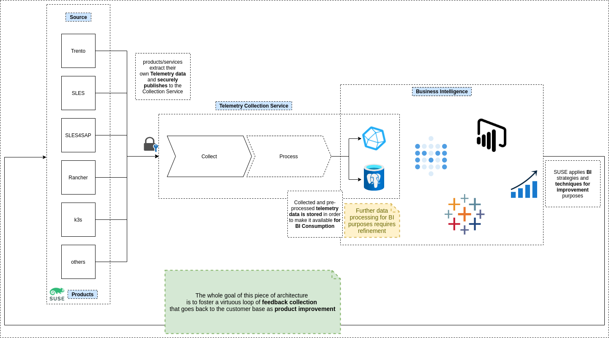
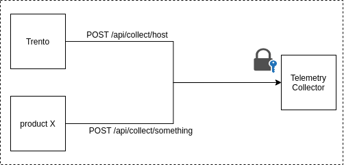

# **Telemetry**

>Telemetry is the in situ collection of measurements or other data at remote points and their automatic transmission to receiving equipment (telecommunication) for monitoring.
>
[Telemetry, Wikipedia](https://en.wikipedia.org/wiki/Telemetry)

---
## **Pitch**

At SUSE we believe in [continuous improvement](https://en.wikipedia.org/wiki/Kaizen), and we want our products get better over time and as our customers' needs change.

In this process we will have to make decisions, and we believe that a wide range of *inputs*, *perspectives* and *information* will help us in making better decisions.

This is why, next to a close feedback-based collaboration with our customers, we are coming with this **Telemetry Service**, which is responsible of collecting meaningful inputs for our improvement.

Telemetry is used by SUSE to make the products better and is not shared with third-parties.

---
## **Concepts**

### **Telemetry**
Anonymous information collected to provide extra feedbacks to the organization for strategic decisions towards improvement.

eg. *number of CPUs*, *SLES version*, *Cloud Provider*

### **Source**
A Source is possibly any of the products/services that [SUSE offers](https://www.suse.com/products/) which can be enabled to publish telemetry.


For instance 
- Trento
- SUSE Linux Enterprise Server
- SUSE Linux Enterprise Server for SAP Applications
- others...

Every *Source* is free to define its own telemetry and responsible to implement its *Extraction* and subsequent *Publishing* to the Telemetry Service.

### **Telemetry Service**

Telemetry Service (aka *Collector Service*, *Telemetry Collector Service*) is an application whose main responsibility is to collect meaningful **Data** being published by different **Sources**.


and *process* (?) that information in order to make it Consumption-ready.

### **Consumption**
T.B.D.

This is a *deliberatedly-very-generic* placeholder for what comes after collection.

That is the organization consuming collected information as feedbacks for product improvement.

Out of scope atm.

### **Basic Flow**


A **Source** extracts **Telemetry data** and publishes it to a **Telemetry Collector Service**. Upon **Consumption** the collected information becomes precious **feedback for improvement**.

---
## **Big Picture**


Any of the SUSE products or services enabled for Telemetry collection *defines*, *extracts* and then ***securely publishes*** Telemetry data to the Collection Service which is responsible to make collected data available for Business Intelligence whose outcome is products improvements based on collected information.

---
## **Extraction-Publishing-Collection**
Given the diversity of the products offered in terms of purpose, strategic impact, technologies, ecosystems, age... each of the **Sources** is responsible for the definition of what's important for them to collect (aka the **Telemetry**), the actual **Extraction** from the system (retriveal of data from any reasonable location it might be necessary) and the integration of [**secure publishing**](###communication-security) to the **Telemetry Collector Service** via HTTPS endpoint(s) it exposes



**Note:** the endpoints mentioned in previous picture are just samples, a more stable contract needs to be defined.

### **Extraction Process**
There is no strict requirement for the **Source** on how to **Extract** the **Telemetry**.
The Source knows its own *world* and how to extract the data it needs.

### **Publishing**
Publishing at the moment means making an HTTP(S) POST request to the **Telemetry Collector Service** and this integration happens at a **Source** level.

In the future we might want to provided client librabries/SDKs to make the integration easier.

#### **Publishing Contracts**
As mentioned the communication goes over an HTTP(S) POST request with a JSON payload.

```json
{
    "application": "<the-source>",
    "telemetry_type": "host_telemetry",
    "time": "2021-11-23T11:04:02.462687463+01:00",
    "payload": ... whatever the Source has extracted and wants to publish
}
```

Example of what Trento Publishes in relation to what has been defined as *Host Telemetry*, which gives SUSE insights about the SAP System where Trento is installed.

```json
{
    "application": "trento",
    "telemetry_type": "host_telemetry",
    "time": "2021-11-23T11:04:02.462687463+01:00",
    "payload": [
        {
            "installation_id": "7826342e-8888-8888-8888-253f89af9127",
            "agent_id": "e93c2b22-5555-5555-8666-12372d2cb8ac",
            "sles_version": "15-SP2",
            "cpu_count": 2,
            "socket_count": 8,
            "total_memory_mb": 4096,
            "cloud_provider": "azure",
            "time": "2021-11-23T11:04:02.462687463+01:00"
        },
        {
            "installation_id": "7826342e-8888-8888-8888-253f89af9127",
            "agent_id": "e93c2b22-4444-4444-4444-12372d2cb8ac",
            "sles_version": "15-SP2",
            "cpu_count": 2,
            "socket_count": 8,
            "total_memory_mb": 4096,
            "cloud_provider": "azure",
            "time": "2021-11-23T11:04:02.462687463+01:00"
        }
    ]
}
```
(FTR: actually, atm, Trento is publishing the plain payload, without any wrapping structure. For service generalization purposes these communication contracts need to be refined and stabilized)

### **Communication Security**
T.B.D.

## **Storage**
In order to make the collected information available for consumption and BI, we currently store the collected **Telemetry** in:
- Influxdb
- Postgresql

At the moment these systems are where we can query the collected information.

## **Analytics and Business Intelligence**
T.B.D.

## **Giveback to the customer base**
All of this to give back improved products to our customers.